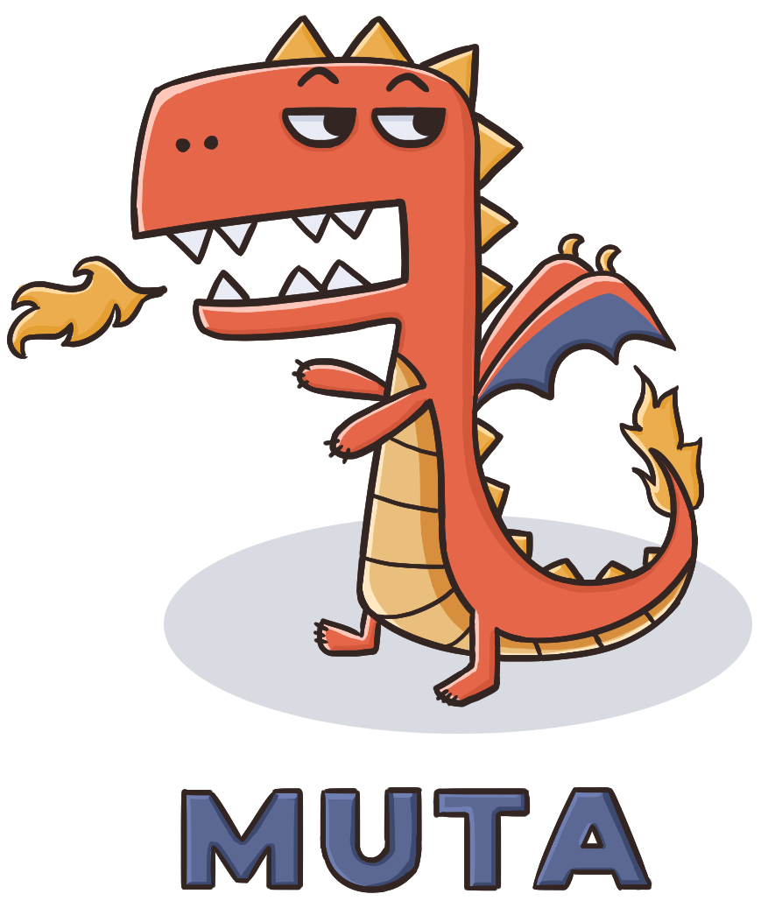

  
  <h3 align="center">让世界上任何一个人都可以搭建属于他们自己的区块链</h3>
  

    
    
    
    
    
  

  

     由 Nervos 团队开发 
  

## 什么是 Muta？

Muta 是一个高度可定制的高性能区块链框架。它具有高吞吐量和低延迟的类 BFT 共识算法「Overlord」，并可以支持不同的虚拟机，包括 CKB-VM、EVM 和 WASM。Muta 具有跨 VM 的互操作性，不同的虚拟机可以同时在一个 Muta 区块链中使用。Muta 大大降低了开发者构建高性能区块链的障碍，同时仍然保证了其最大限度地灵活性以定制他们的协议。Muta 由 Nervos 团队开发，旨在让世界上任何一个人都可以启动属于他们自己的区块链平台，同时享受 Nervos CKB 所带来的安全性和最终性。

Muta 的核心理念便是使一个区块链的状态转换功能的开发尽可能的灵活和简便，因此，Muta 框架提供了一个区块链系统需要有的基础功能部分，开发者可以自由定制链的功能部分。

## Muta 提供哪些基础功能核心组件？
 
Muta 框架提供了搭建一个分布式区块链网络所需的全部核心组件：

* [交易池](./transaction_pool.md)
* [P2P 网络](./network.md)
* [共识](./overlord.md)
* 数据存储

## 开发者需要自己实现的部分

开发者可以通过开发 Service 来定制链的功能部分。

Service 是 Muta 框架中用于扩展的抽象层，用户可以基于 Service 定义区块治理、添加 VM 等等。每一个 Service 作为一个相对独立的逻辑化组件，可以实现其特定的功能，同时，不同的 Service 之间又可以直接进行交互，从而可以构建更为复杂的功能逻辑。更为灵活的是，不同链的 Service 还可以复用，这使得开发者们可以更为轻松的搭建自己的功能模块。

我们提供了详细的 Service 开发指南，以及一些 Service 示例。

* [Service 开发指南](./service_dev.md)
* [Service 示例](./service_eg.md)

## 贡献 

- :fork_and_knife:Fork 这个项目并 clone 到本地
- :twisted_rightwards_arrows:新建一个分支: `git checkout -b new-branch`
- :wrench:增加新特性或者解决一些 bug
- :memo:提交你的修改: `git commit -am 'Add some feature'`
- :rocket:推送你的分支: `git push origin new-branch`
- :tada:提交 Pull Request

或者提交一个[issue](https://github.com/nervosnetwork/muta/issues) 

- 欢迎任何有帮助性的建议:stuck_out_tongue_winking_eye:

如果愿意参与翻译文档，请到未翻译的英文文档页面上方点击 edit on GitHub 可以找到源文件，直接修改源文件，并且提 PR，步骤同上面的 PR 步骤。
